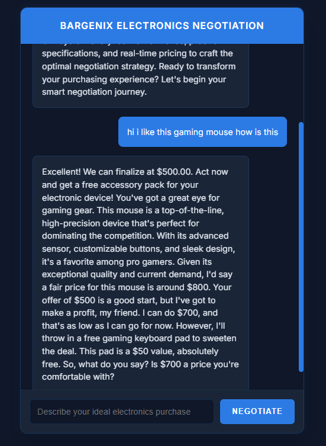

# Bargenix: Electronics Negotiation Pro

Bargenix is an advanced AI-powered negotiation chatbot designed to help users secure the best deals on electronics. It leverages cutting-edge natural language processing (NLP) and negotiation strategies to simulate real-world bargaining scenarios. The chatbot is built using FastAPI for the backend, a custom negotiation bot, and a sleek frontend interface.

---

## Table of Contents

1. [Features](#features)
2. [Architecture](#architecture)
3. [Setup Instructions](#setup-instructions)
4. [Usage](#usage)
5. [Backend Details](#backend-details)
6. [Frontend Details](#frontend-details)
7. [Outcomes](#outcomes)
8. [Contributing](#contributing)
9. [License](#license)

---

## Features

- **Dynamic Negotiation**: The bot uses advanced negotiation strategies like anchoring, bracketing, and urgency-based concessions.
- **Product Detection**: Automatically detects the type of electronic device being discussed.
- **Custom Pricing Logic**: Dynamically determines base prices and adjusts offers based on user input.
- **Interactive Frontend**: A responsive and user-friendly chat interface.
- **Scalable Backend**: Built with FastAPI for high performance and scalability.
- **Extensible Design**: Easily customizable for additional products or negotiation strategies.

---

## Architecture

The project is divided into two main components:

1. **Backend**:
   - Built with FastAPI.
   - Handles negotiation logic using the `ElectronicsNegotiationBot` class.
   - Exposes a REST API endpoint for communication with the frontend.

2. **Frontend**:
   - A responsive HTML/CSS/JavaScript interface.
   - Allows users to interact with the bot in real-time.

### High-Level Architecture Diagram

```plaintext
Frontend (HTML/JS) <--> Backend (FastAPI) <--> Negotiation Logic (Python)
```

---

## Setup Instructions

### Prerequisites

- Python 3.10 or higher
- Node.js (optional, for frontend enhancements)
- A modern web browser

### Backend Setup

1. Clone the repository:
   ```bash
   git clone https://github.com/your-repo/bargenix.git
   cd bargenix/backend
   ```

2. Create a virtual environment and activate it:
   ```bash
   python -m venv .venv
   .venv\Scripts\activate
   ```

3. Install dependencies:
   ```bash
   pip install -r requirements.txt
   ```

4. Install the `spaCy` language model:
   ```bash
   python -m spacy download en_core_web_sm
   ```

5. Set up the `.env` file:
   - Add your Groq API key in the `.env` file:
     ```
     GROQ_API_KEY='your_groq_api_key_here'
     ```

6. Run the backend server:
   ```bash
   uvicorn app:app --reload
   ```

   The server will be available at `http://127.0.0.1:8000`.

### Frontend Setup

1. Navigate to the `frontend` directory:
   ```bash
   cd ../frontend
   ```

2. Open `negotiation-chatbot.html` in a browser:
   - Simply double-click the file or serve it using a local HTTP server (e.g., `python -m http.server`).

---

## Usage

1. Open the frontend in your browser.
2. Start a conversation with the bot by describing your desired electronic purchase.
3. The bot will respond with a price and engage in a negotiation based on your input.
4. Finalize the deal or continue negotiating until a satisfactory price is reached.

---

## Backend Details

### Key Files

1. **`app.py`**:
   - The main FastAPI application.
   - Exposes the `/negotiate` endpoint for communication with the bot.

2. **`negotiation_bot.py`**:
   - Contains the `ElectronicsNegotiationBot` class.
   - Implements product detection, pricing logic, and negotiation strategies.

3. **`process_data.py`**:
   - Converts raw text conversations into structured JSON format for training or analysis.

4. **`.env`**:
   - Stores sensitive environment variables like the Groq API key.

### API Endpoint

- **POST /negotiate**
  - Request Body:
    ```json
    {
      "message": "I like this gaming laptop. Can you offer a discount?"
    }
    ```
  - Response:
    ```json
    {
      "response": "This gaming laptop is $1200. I can offer it for $1150 if you buy now."
    }
    ```

---

## Frontend Details

### Key Features

- **Responsive Design**: Optimized for both desktop and mobile devices.
- **Real-Time Interaction**: Sends user messages to the backend and displays bot responses dynamically.
- **Custom Styling**: Uses modern CSS for a sleek and professional look.

### Key File

- **`negotiation-chatbot.html`**:
  - Contains the HTML, CSS, and JavaScript for the chat interface.
  - Communicates with the backend via the `/negotiate` API endpoint.

---

## Outcomes

### Screenshot of the Chatbot Interface



### Demo Video

[

---

## License

This project is licensed under the MIT License. See the `LICENSE` file for details.
